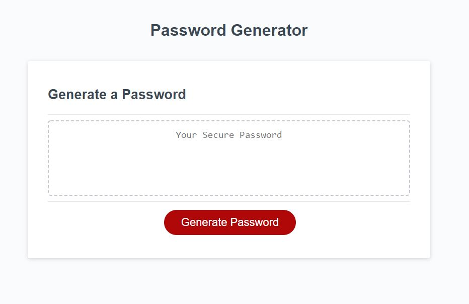

# carlyGougePasswordGen
This is a random password generator that generates a password based on user input and preference. 

## Link to deployed application
* [Deployed page](https://https://cgouge93.github.io/carlyGougePasswordGen/)
## How it works
1. User clicks on "Generate Password" button to begin browser prompts. 

2. User is asked how many characters long they would like their password to be. The program will only advance to next prompts if user input ranges from 8-128.

3. User is asked to confirm whether they'd like their password to contain uppercase letters, lowercase letters numbers, and special characters.

4. Password is generated and displayed on page based on critrea chosen.
[screenshot of generated password](assets/generatedPW.JPG)

## GIF of application in action

